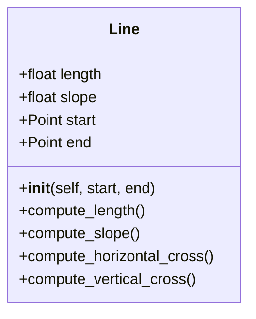
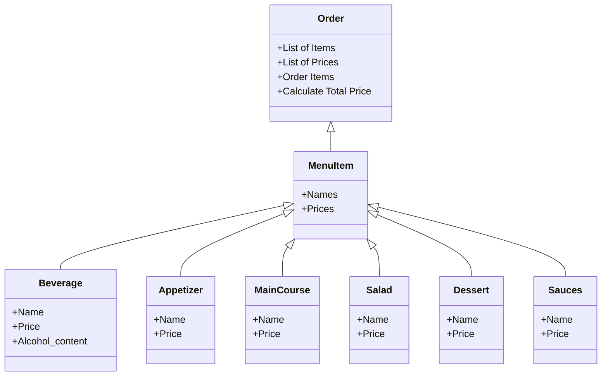

# Reto 3
## Class Line

```python
class Point:
    def __init__(self, x=0, y=0):
        self.x = x
        self.y = y

class Line:
    def __init__(self, point1, point2):
        self.point1 = point1
        self.point2 = point2

    def compute_length(self):
        return ((self.point2.x - self.point1.x)**2 + (self.point2.y - self.point1.y)**2)**0.5
    
    def compute_slope(self):
        self.slope = (self.point2.y - self.point1.y) / (self.point2.x - self.point1.x)
    
    def compute_horizontal_cross(self):
        if self.point1.y <= 0 and self.point2.y >= 0:
            return True
        elif self.point1.y >= 0 and self.point2.y <= 0:
            return True
        else:
            return False
        
    def compute_vertical_cross(self):
        if self.point1.x <= 0 and self.point2.x >= 0:
            return True
        elif self.point1.x >= 0 and self.point2.x <= 0:
            return True
        else:
            return False
        
class Rectangle:
    def __init__(self, left_line, right_line, top_line, bottom_line):
        self.left_line = left_line
        self.right_line = right_line
        self.top_line = top_line
        self.bottom_line = bottom_line

    def compute_area(self):
        return (self.right_line.point2.x - self.left_line.point1.x) * (self.top_line.point2.y - self.bottom_line.point1.y)
    
    def compute_perimeter(self):
        return 2 * (self.right_line.compute_length() + self.top_line.compute_length())
    
first_point = Point(1, 1)
second_point = Point(7, 1)
third_point = Point(7, 5)
fourth_point = Point(1, 5)

bottom_line = Line(first_point, second_point)
right_line = Line(second_point, third_point)
top_line = Line(third_point, fourth_point)
left_line = Line(fourth_point, first_point)

rectangle = Rectangle(left_line, right_line, top_line, bottom_line)
print("Area: ", rectangle.compute_area())
print("Perimeter: ", rectangle.compute_perimeter())
```
## Restaurant Scenario
Restaurant scenario: You want to design a program to calculate the bill for a customer's order in a restaurant.
* Define a base class MenuItem: This class should have attributes like name, price, and a method to calculate the total price.
* Create subclasses for different types of menu items: Inherit from MenuItem and define properties specific to each type (e.g., Beverage, Appetizer, MainCourse).
* Define an Order class: This class should have a list of MenuItem objects and methods to add items, calculate the total bill amount, and potentially apply specific discounts based on the order composition.
```python
class MenuItem:
    def __init__(self, name, price):
        self.name = name
        self.price = price
    
    def calculate_total_price(self):
        return self.price
    
class Berevarage(MenuItem):
    def __init__(self, name, price, alcohol_content:bool):
        super().__init__(name, price)
        self.alcohol_content = alcohol_content
    
    def calculate_total_price(self):
        return self.price
    
class Appetizer(MenuItem):
    def __init__(self, name, price):
        super().__init__(name, price)
    
    def calculate_total_price(self):
        return self.price
    
class MainCourse(MenuItem):
    def __init__(self, name, price):
        super().__init__(name, price)
    
    def calculate_total_price(self):
        return self.price
    
class Salad(MenuItem):
    def __init__(self, name, price):
        super().__init__(name, price)
    
    def calculate_total_price(self):
        return self.price
    
class Dessert(MenuItem):
    def __init__(self, name, price):
        super().__init__(name, price)
    
    def calculate_total_price(self):
        return self.price
    
class Sauces(MenuItem):
    def __init__(self, name, price):
        super().__init__(name, price)
    
    def calculate_total_price(self):
        return self.price
    
class Order:
    def __init__(self):
        self.items = []
    
    def add_item(self, item):
        self.items.append(item)
    
    def calculate_total_price(self):
        total = 0
        for item in self.items:
            total += item.calculate_total_price()
        return total
    
menu_items = [
    Berevarage("Soda", 5000, False),
    Berevarage("Beer", 7000, True),
    Berevarage("Water", 3000, False),
    Appetizer("Empanadas", 3000),
    Appetizer("Nachos", 4000),
    Appetizer("Shrimp Rolls", 5000),
    MainCourse("Meat", 25000),
    MainCourse("Fish", 23000),
    MainCourse("Chicken", 20000),
    Salad("Florentina", 8000),
    Salad("Mediterrenean", 9000),
    Salad("Mexican", 10000),
    Dessert("Ice Cream", 5000),
    Dessert("Brownie", 6000),
    Dessert("Banan Split", 7000),
    Sauces("Ketchup", 1000),
    Sauces("Mayo", 1000),
    Sauces("Mustard", 1000)
]

order = Order()
order.add_item(menu_items[1])
order.add_item(menu_items[3])
order.add_item(menu_items[7])
order.add_item(menu_items[9])
order.add_item(menu_items[11])

for item in menu_items:
    order.add_item(item)

print(order.calculate_total_price())
```
Create a class diagram with all classes and their relationships. The menu should have at least 10 items. The code should follow PEP8 rules.

